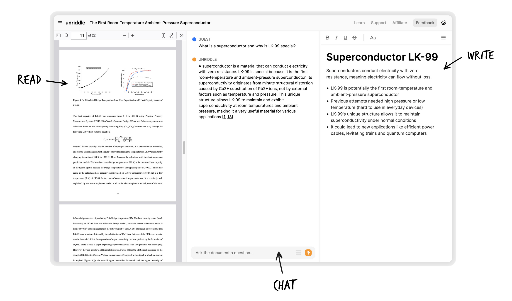
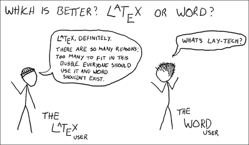
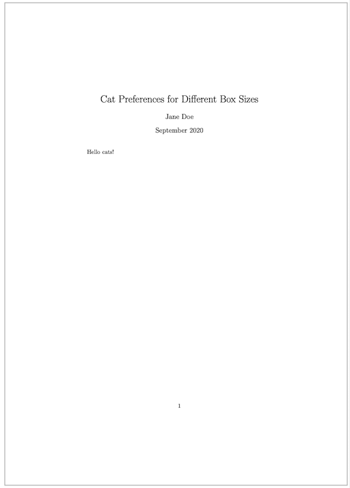
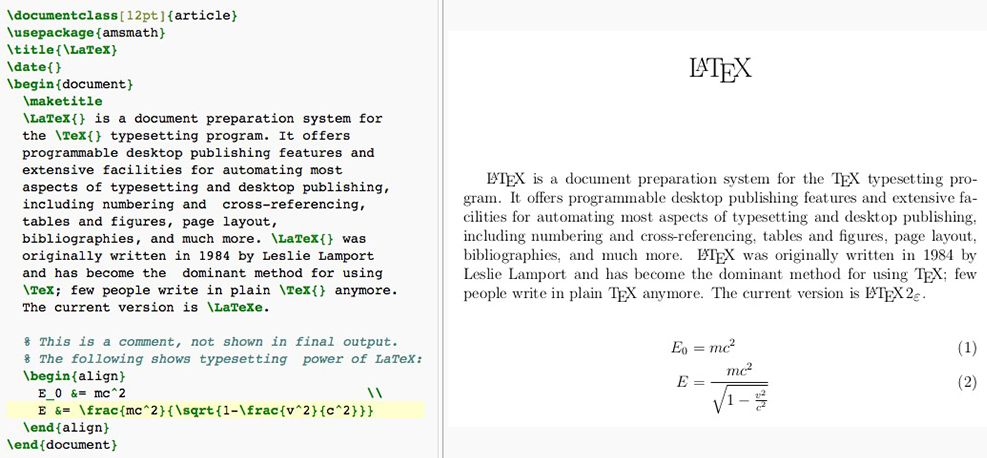
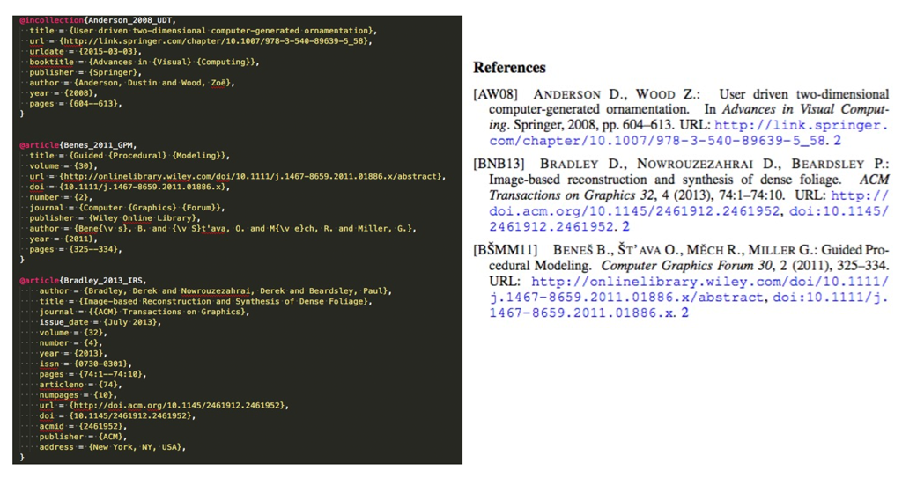
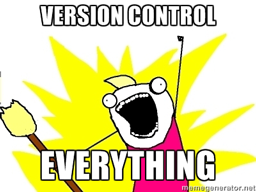

name: inverse
layout: true
class: center, middle, inverse
---


# Academic Methodologies

### Prof. Dr. Lena Gieseke | l.gieseke@filmuniversitaet.de  

#### Film University Babelsberg KONRAD WOLF


---
layout: false

## Today

--
* Working with Literature

--
* Citations

--
* LaTeX

--
* Academic Writing
* Anatomy of a Paper


---
template:inverse

# Working with Literature

???
.task[COMMENT:]  


* Searching
    * Engines
    * Digital Libraries
* Strategies
    * Searching
    * Collecting
    * Reading
* Management Tools
* Literature Surveys

---
.header[Literature]

## Search Engines

* Google Scholar
    * Best in terms of volume and being up-to-date
    * Shows you where to find the document
    * You can follow who cited that entry

--

* Search: [17 Powerful Google Scholar Alternative Tools](https://www.unriddle.ai/blog/google-scholar-alternative), [The top list of academic search engines](https://paperpile.com/g/academic-search-engines/), etc.


???
.task[COMMENT:]  

* Search for "alternatives for google scholar", e.g. with Research Gate coming up.

---
.header[Literature]

## Digital Libraries

Multiple disciplines:


* Springer Link
* Elsevier
* MIT Press Direct


---
.header[Literature]

## Digital Libraries

HCI / Computer Science (all content is of fairly high quality):

* ACM Digital Library
    * Association for Computer Machinery
    * Computing society
* IEEE Xplore
    * Institute of Electrical and Electronic Engineers 
    * Technical professional organization dedicated to advancing technology
* Eurographics Digital Library
    * European Association for Computer Graphics


---
.header[Literature]

## Search Strategies

--
* Keywords

--
* Authors

--
* References in papers
    * Follow the citations in the paper
--
* Venues
    * Journals, conferences that fit topic-wise

--
> It is not an accomplishment to find literature. Reading the right one really is!

---
.header[Literature]

## Search Strategies

.center[]
  
.imgref[[[theshirtlist]](https://www.theshirtlist.com/down-the-rabbit-hole-t-shirt-2/)]

---
.header[Literature]

## Collection Strategies

--

* Set yourself a time frame

--
* Decide on the type of search, e.g.
    * broad vs. deep?
    * with certain keyword(s)
--
* Be disciplined with the search

--
* Have a setup 
    * Which references to save?
    * How, where and under which name to save?
    * How to come back to the reference (assign a prioritization)?

???
.task[COMMENT:]  

* Set yourself a time frame, otherwise hours over hours might just pass by.
* Decide on the type of serach you want to do: narrow vs. broad. What is it you want to archive with this search? Get an overview? Get specific related work for an algorithm?
* For a more narrow search, be disciplined about staying on track of certain keywords, for example.
* Maybe decide on a number of papers you want to save, which should be connected to the actual time you have to read them.
* Have a setup ready that decides
    * how to decide which papers to save,
    * how (pdf vs. online link?), where and under which name to save papers,
        * E.g. I save paper as `firstauthorlastname_year_firstlettersofthefirstthreewordsofthetitle.pdf`, such as `wong_1998_cgf.pdf`
    * wether to give them directly a prioritization on what to read next, and
    * how to make sure that you come back to these papers and actually read them.

---
.header[Literature]

## Collection Strategies

--
* Read the title

--
* Read the abstract

--
* Look for a list of contributions and if found read them

--
* Look at the figures one by one and read their captions

--
* Look at additional materials such as a project page or supplemental videos

--

> The more decisions you make about the reference right away, the more time you save later on.

???
.task[COMMENT:]  

* The more decisions you make about the paper right away (whether to save, read, read first, tags,... ?), the more time you save later on, when you have to once again remember what the paper was about and whether you should read it.

---
.header[Literature]

## Management Tools

A lot is happening - this script is probably out of date!

--

> Any suggestions?

---
.header[Literature | Management Tools]

## [unriddle](https://www.unriddle.ai/)

.center[  
.imgref[[[unriddle]](https://www.unriddle.ai/)]]


---
.header[Literature]

## Reading Strategies

Ideally, you should have a system, which tells you what to read next.  
  
For this also reading lists in a literature management tools can be helpful.


???
.task[COMMENT:]  

* Reading many papers makes you a better researcher
* Also across topics

---
.header[Literature]

## Reading Strategies

Read with intention

--
* *Why are you reading this paper?*

--
* *What is it that you want to know and gain from reading this paper?*

---
.header[Literature]

## Reading Strategies


???
.task[COMMENT:]  

* Homework readings

---
.header[Literature | Reading Strategies]

## The PQ4R Mthod


???
.task[COMMENT:]  
There are several "reading methods" out there, for example the PQ4R method:

--

* **P**review
    * Overview, scanning
* **Q**uestions
    * What do you want to know from the paper?
* **R**ead
* **R**eflect
    * Reflect arguments, are there counter arguments?
* **R**ecite
    * Be able to summarize content in your own words.
* **R**eview
    * Critical questioning of content.

---
template:inverse

# Literature Survey

---
.header[Literature]

## Literature Survey

--

A literature survey is a **systematic** and **comprehensive** reflection of the present state of a specific research topic.  

--
  
Contributions can be

???
.task[COMMENT:]  

* They investigate what is known and what open questions there still are. They do so on the basis of the currently available literature, e.g. other papers. A STAR is a [meta analysis](https://en.wikipedia.org/wiki/Meta-analysis) of a research topic and you could also consider it a specific type of case study (with the papers as cases). 

--

* Timeline
* Terminology
* Classification(s)
* Taxonomy
* Comparisons


???
.task[COMMENT:]  

* A STAR usually goes far beyond a simple collection and summary of the topic and its related work. The most common contributions of STAR papers are a timeline, the development of a common terminology, a classification (usually as a table), a [taxonomy](https://en.wikipedia.org/wiki/Taxonomy_(general)) (usually as a tree) and a comparison based on certain features. But you will see different approaches. 
* To write a STAR you should start with the topic and some ideas what your contributions should be. Based on these you define a search strategy (rigor, completeness) and a scope (criteria for inclusion and exclusion). Both should be discussed in the paper.


---
template:inverse

# Citations


???
.task[COMMENT:]  

* For documenting the research goals of novelty and relevance we need to put our work into context. In academia, ideally everything you do must be based on something that has already been published. For that we reference other papers and now we have a look onto the formal style of citing other work.

---
## Citations

* Direct citations
    * Exact words are copied and put into “”
    * Very uncommon in Computer Science, only used with definitions, e.g. 
        * Standard Y defines X as „…“ [5]
--
* Citing the meaning 
    * Summarising, paraphrasing, …
    * It needs to be clear where the citation starts and stops
    * This basically means that you re-write the content
        * Smith et al. [2] found …
--
* Short reference
    * List of related work and/or used techniques
        * We applied approach X [2] to …

---
.header[Citations]

## Citation Style

--

A citation style defines

* which information is necessary for a citation,
* how to order the information, 
* punctuation and formatting.
  

???
.task[COMMENT:]  

* Citation styles make reference lists and bibliographies consistent and easy to read across different papers.
  
--
  
Correct and clean citations are a must-have in academia. The golden rule here is *consistency* and not so much which style to use. 


---
.header[Citations | Citation Style]

### MLA

Frank, H. "Wolves, Dogs, Rearing and Reinforcement: Complex Interactions Underlying Species Differences in Training and Problem-Solving Performance." Behavior Genetics 41.6 (2011): 830-39. Print.
  

### Chicago

Frank, H. 2011. "Wolves, Dogs, Rearing and Reinforcement: Complex Interactions Underlying Species Differences in Training and Problem-Solving Performance."  Behavior Genetics 41 (6):830-839. 

### APA

Frank, H. (2011). Wolves, Dogs, Rearing and Reinforcement: Complex Interactions Underlying Species Differences in Training and Problem-Solving Performance. Behavior Genetics, 41(6), 830-839. 

???
.task[COMMENT:]  

* (I personally don't care which style you use as long as you follow one)
* Which citation style to prefer highly depends on the academic discipline:
    * [MLA (Modern Language Association)](https://www.mla.org/MLA-Style)
        * Most popular
        * English, Humanities
    * [APA (American Psychological Association)](https://apastyle.apa.org/)
        * Education, Psychology, and Sciences
    * [Harvard](https://en.wikipedia.org/wiki/Parenthetical_referencing) 
        * Similar to APA
        * More common in the UK and Australia
    * [Vancouver](https://en.wikipedia.org/wiki/Vancouver_system)
        * Medicine and sciences
    * [Chicago/Turabian](https://www.chicagomanualofstyle.org/tools_citationguide.html)
        * Economics, History, and the Fine Arts

---
.header[Citations]

## Citation Style

It is up to you to decide where in the text to spell out authors names as reference as in-text citation and where to use shorter citation tags:

* Smith et al. [SJT12] demonstrate in their work about...
* ... developed in the context of architectural designs [LWW08], tree modeling [PSK∗12] and the creation of natural scenes [EVC∗15].


???
.task[COMMENT:]  

* For in text citations and author-based references, the list of authors is shortened:

* ‘Smith and Jones’ for up to two authors
* ‘et al.’ for ‘and others’ for more
    * Smith and Jones [SJ12]
    * Smith et al. [SJT12], [SJT*12] (for more than three authors)


You will often see a DOI included in a references auch as `DOI: 10.1002/asi.20801`. The DOI (Digital Object Identifier) is a unique number used to identify a specific article.

It takes a lot of time to clean the information for a reference so that it shows up correctly. Different document types need different information. Sometimes your will need to collect the required information manually. I find the [tool](http://www.citethisforme.com) and the information on [cite this for me](http://www.citethisforme.com/guides) helpful.

If you are using a LaTeX template given out by the publication venue, the style comes with the template as `\bibliographystyle{style_name}`. You still need to setup your references accordingly, meaning the bibtex entries must be correct and complete.

---
.header[Citations]

## Quick Citation Generation

* [Cite This For Me](https://www.citethisforme.com/) (they just implemented a new pay-wall though)


---
template:inverse


#### Detour
# LaTeX

---
## LaTeX

.center[]
.imgref[[[inzaneresearch]](https://inzaneresearch.com/2018/07/06/grad-school-tools-latex-basics/)]


---
## LaTeX

> LaTeX follows the principles of separating presentation from content.


???
.task[COMMENT:]  

* LaTeX, which is pronounced "Lah-tech" or "Lay-tech" (to rhyme with «blech» or «Bertolt Brecht» as the X is the greek letter chi), is a document preparation system for high-quality typesetting. It is most often used for medium-to-large technical or scientific documents but it can be used for almost any form of publishing.

--
* Similar to html + css

--
* LaTeX is not a word processor

???
.task[COMMENT:]  

* Instead, LaTeX encourages authors not to worry too much about the appearance of their documents but to concentrate on getting the right content.

--
* The styling usually with given templates, e.g., from the publication venue  
  
--
    * *"Leave document design to document designers."*


---
## LaTeX

.left-even[
```latex
\documentclass{article}
\title{Cat Preferences for Different Box Sizes}
\author{Jane Doe}
\date{September 2020}
\begin{document}
   \maketitle
   Hello cats!
\end{document}
```
]


???
.task[COMMENT:]  

* LaTeX is based on the idea that it is better to leave document design to document designers, and to let authors get on with writing documents. So, in LaTeX you would input this document as:
* Or, in English:
    * This document is an article.
    * Its title is Cat Preferences for Different Box Sizes.
    * Its author is Jane Doe.
    * It was written in September 2020.
    * The document consists of a title followed by the text Hello world!

The output looks like:

--
.right-even[]
  


???
.task[COMMENT:]  

* https://www.overleaf.com/project
* The underlying TEX computer program, created by Donald E. Knuth, is aimed at typesetting text and mathematical formulae. TEX as we use it today is still pretty much the same as the release version in 1982, with some slight enhancements added in 1989 to better support 8-bit characters and multiple languages. TEX is renowned for being extremely stable, for running on many different kinds of computers, and for being virtually bug free. The version number of TEX is converging to π and is now at 3.141592653.
* LaTeX uses TeX as its formatting engine and enables authors to typeset and print their work with high typographical quality, using a predefined layout. In a LaTeX environment, LaTeX takes the role of the book designer and uses TEX as its typesetter. But LaTeX is only a program and the author has to provide additional information to describe the logical structure of the work. This information is written into the text as LaTeX commands.
* Hence, LaTeX is a markup language and not WYSIWYG (what you see is what you get). You need to compile the pdf. Tags define the general structure of a document (such as article, book, and letter), to stylize text throughout a document (such as bold and italic), and to add citations and cross-references.

---
## LaTeX

Crucial advantages:

--
* Mathematical formulas

--
* References and citations


---
## LaTeX


.imgref[[wikipedia](https://en.wikipedia.org/wiki/LaTeX)]


---
.header[LaTex]

## BibTeX

--
* Reference management

--
* Comes with LaTeX

???
.task[COMMENT:]  

* With LaTeX comes BibTeX. BibTeX is a reference management software for formatting lists of references. 
* A BibTeX database of references is stored as a `.bib` file, which you write as plain text file. References and citations are then automatically created and formatted based on the `.bib` file. Most literature management tools import/export BibTeX entries.


--
* Formats lists of references


---
.header[LaTex]

## BibTeX

`bibliography.bib`:

```bibtex
@article{togelius_2011_sbp, 
    author={J. Togelius and G. N. Yannakakis and K. O. Stanley and C. Browne}, 
    journal={IEEE Transactions on Computational Intelligence and AI in Games}, 
    title={Search-Based Procedural Content Generation: A Taxonomy and Survey}, 
    year={2011}, 
    volume={3}, 
    number={3}, 
    pages={172-186},
}
```

--

`body.tex`:

```latex
\cite{togelius_2011_sbp}
```

---
.header[LaTex]

## BibTeX

`bibliography.bib`:

```bibtex
@article{togelius_2011_sbp, 
    author={J. Togelius and G. N. Yannakakis and K. O. Stanley and C. Browne}, 
    journal={IEEE Transactions on Computational Intelligence and AI in Games}, 
    title={Search-Based Procedural Content Generation: A Taxonomy and Survey}, 
    year={2011}, 
    volume={3}, 
    number={3}, 
    pages={172-186},
}
```

`body.tex`:

```
The algorithm improves performance by 20s (\cite{togelius_2011_sbp}).
```


---
.header[LaTex]

## BibTeX

.center[]


???
.task[COMMENT:]  

*On the left you see the .bib file and on the right the automatically produced reference list.*
* Once again, you still have to take care of the bib entries in the `.bib` file yourself. To create a consistent and complete BibTeX list of references for a paper takes forever… be aware!
* LaTeX and BibTeX files have the advantage that they are simple text files, which fit well to version control systems such as GitHub. In comparison, such version control system often have problems with the tracking of changes in `.docx` files, for example. As with other coding projects, you only commit the source files not their build.

---
.header[LaTeX]

## Environments

* VSCode with extensions, e.g., [LaTeX Workshop](https://marketplace.visualstudio.com/items?itemName=James-Yu.latex-workshop)
* [Overleaf](https://www.overleaf.com/) (by now my preferred choice)

---
## LaTeX

.center[]  
.imgref[[[github]](https://github.com/captn3m0/awesome-vcs)]  


???
.task[COMMENT:]  

* LaTeX and BibTeX files have the advantage that they are simple text files, which fit well to version control systems such as GitHub. In comparison, such version control system often have problems with the tracking of changes in .docx files, for example. As with other coding projects, you only commit the source files not their build.


---
template:inverse

# Next

---
## Next

Next, we are looking at the anatomy of a paper. A paper has a fractal quality to it:

* The document has an introduction, body, conclusion
    * A section has an introduction, body, conclusion
        * A subsection has an introduction, body, conclusion
            * A paragraph has an introduction, body, conclusion


---
template:inverse

### The End

# 👋🏻
