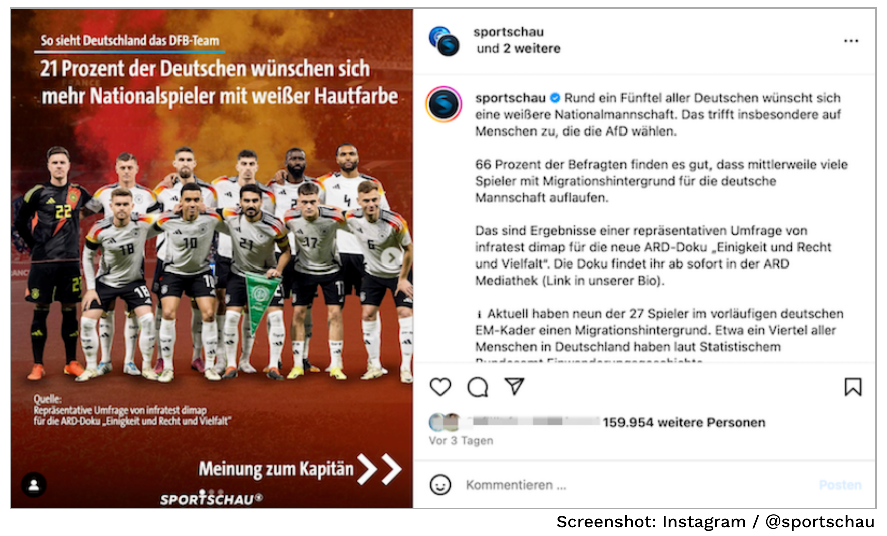
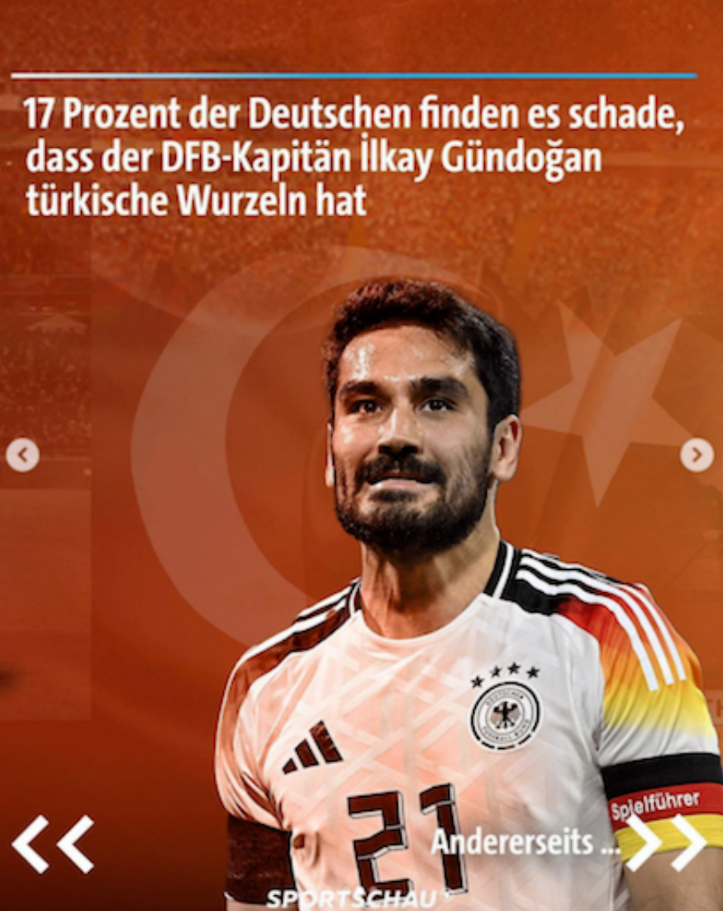
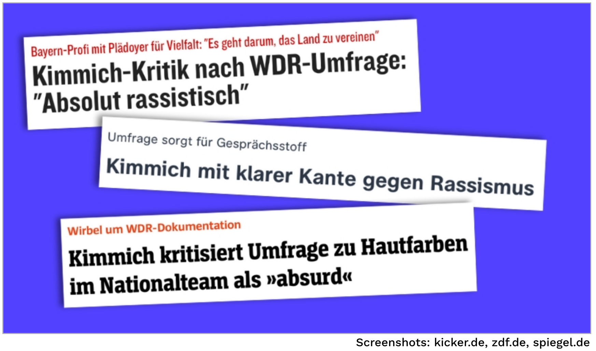
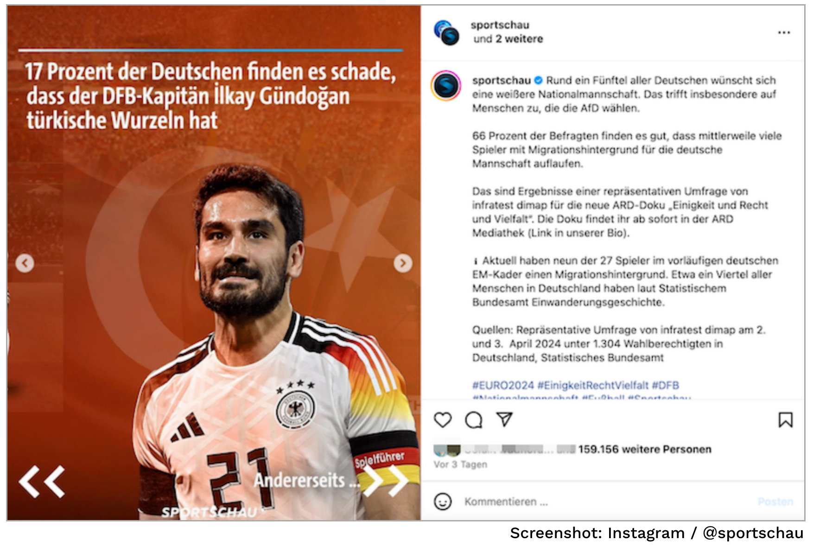
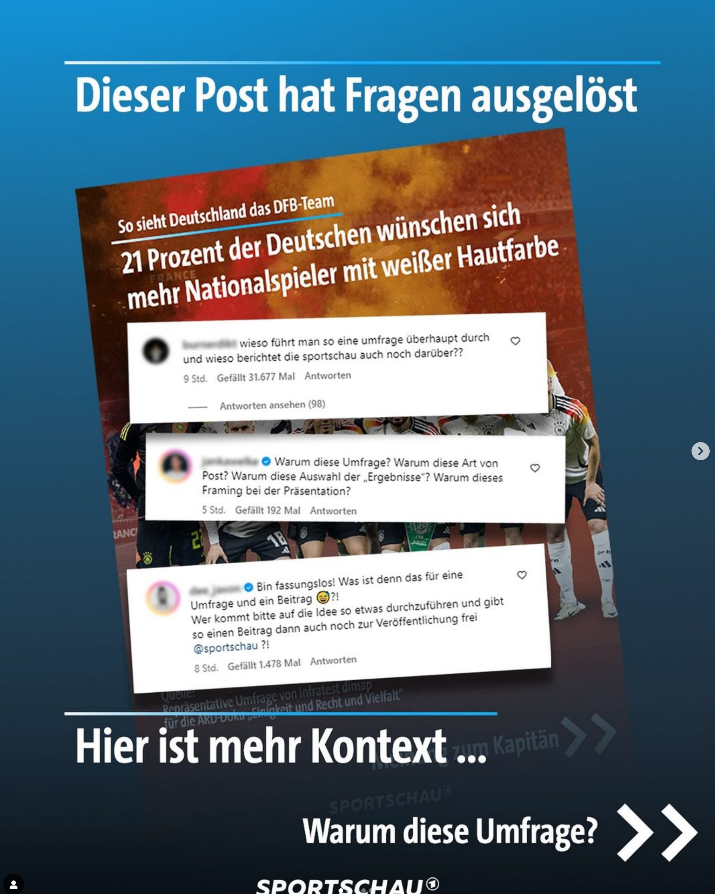
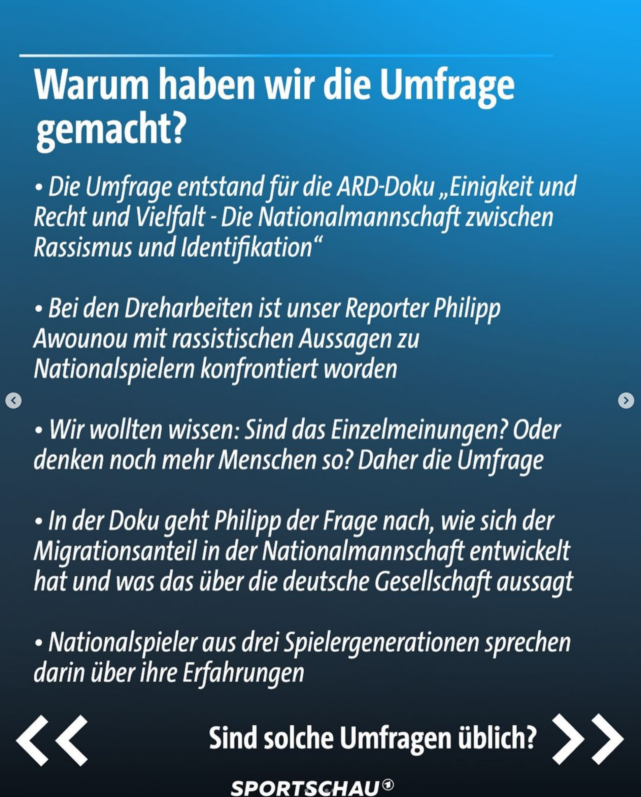
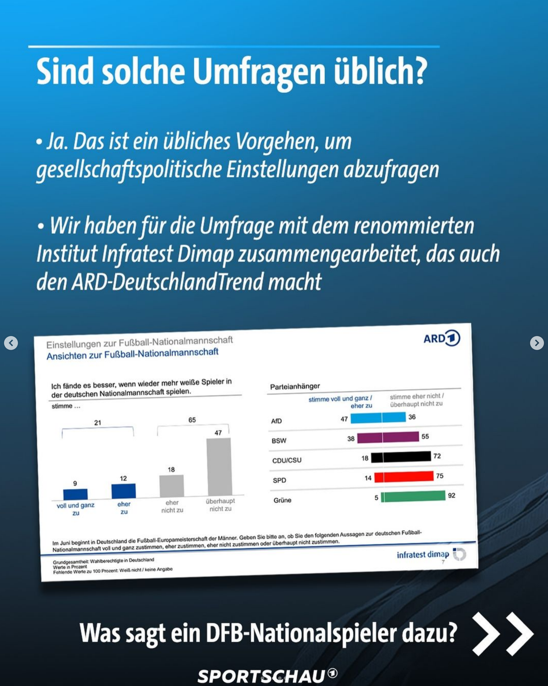

name: inverse
layout: true
class: center, middle, inverse
---

# Academic Methodologies

### Prof. Dr. Lena Gieseke | l.gieseke@filmuniversitaet.de  

#### Film University Babelsberg KONRAD WOLF

---
layout:false

## Today

--
* Academic Writing

--
* Anatomy of a Paper

--
* Language & Style

---
template:inverse

#### Detour

# Survey About Racism in Football

---

.center[]

.footnote[[L. Kräher. 2024. [Finden Sie es schlimm, dass der WDR eine Umfrage zu Rassismus im Fußball beauftragt hat?](https://uebermedien.de/95764/finden-sie-es-schlimm-dass-der-wdr-eine-umfrage-zu-rassismus-im-fussball-beauftragt-hat/) Übermedien]]

---

.center[]

.footnote[[L. Kräher. 2024. [Finden Sie es schlimm, dass der WDR eine Umfrage zu Rassismus im Fußball beauftragt hat?](https://uebermedien.de/95764/finden-sie-es-schlimm-dass-der-wdr-eine-umfrage-zu-rassismus-im-fussball-beauftragt-hat/) Übermedien]]

---

.center[]

.footnote[[Sportschau. 2024. Instgram]]

---

.center[]

.footnote[[L. Kräher. 2024. [Finden Sie es schlimm, dass der WDR eine Umfrage zu Rassismus im Fußball beauftragt hat?](https://uebermedien.de/95764/finden-sie-es-schlimm-dass-der-wdr-eine-umfrage-zu-rassismus-im-fussball-beauftragt-hat/) Übermedien]]

---

[.center[]](https://www.ardmediathek.de/video/Y3JpZDovL2Rhc2Vyc3RlLmRlL3Nwb3J0c2NoYXUvMjAyNC0wNi0wNV8yMS0zMC1NRVNa)

---
## Documentation *Einigkeit und Recht und Vielfalt* by Philipp Awounou 

* About the men's national football team
* How diversity within developed over the years
* Football players re-tell their experiences with racism

.footnote[[L. Kräher. 2024. [Finden Sie es schlimm, dass der WDR eine Umfrage zu Rassismus im Fußball beauftragt hat?](https://uebermedien.de/95764/finden-sie-es-schlimm-dass-der-wdr-eine-umfrage-zu-rassismus-im-fussball-beauftragt-hat/) Übermedien]]

???
.task[COMMENT:]  

* In dem Film geht es um die deutsche Nationalmannschaft und wie diese im Laufe der vergangenen Jahrzehnte vielfältiger geworden ist. Deutsche Fußballprofis mit Migrationsgeschichte sprechen im Film auch über die Rassismus-Erfahrungen, die sie im Laufe ihrer Karriere gemacht haben. 

---
## Documentation *Einigkeit und Recht und Vielfalt* by Philipp Awounou 

> [...] alles in allem ein eindrucksvoller, differenzierter Beitrag. Er behauptet nicht, dass alles schlecht ist, sondern erzählt auch, was sich in den vergangenen Jahrzehnten zum Besseren entwickelt hat. Und es ist ein Film, der vielen Perspektiven Raum gibt, auch denen, die man eigentlich lieber gar nicht hören will. 

.footnote[[L. Kräher. 2024. [Finden Sie es schlimm, dass der WDR eine Umfrage zu Rassismus im Fußball beauftragt hat?](https://uebermedien.de/95764/finden-sie-es-schlimm-dass-der-wdr-eine-umfrage-zu-rassismus-im-fussball-beauftragt-hat/) Übermedien]]

---
## Documentation *Einigkeit und Recht und Vielfalt* by Philipp Awounou 

--
* Common use of racist terms, e.g. among fans

--
*  A man in a parking lot in Thuringia says that the teams are "no longer German" and that a "real German" for him is "light-skinned"

.footnote[[L. Kräher. 2024. [Finden Sie es schlimm, dass der WDR eine Umfrage zu Rassismus im Fußball beauftragt hat?](https://uebermedien.de/95764/finden-sie-es-schlimm-dass-der-wdr-eine-umfrage-zu-rassismus-im-fussball-beauftragt-hat/) Übermedien]]

???
.task[COMMENT:]  

* „Unser Reporter Philipp Awounou wurde in Interviews bei den Dreharbeiten zu der Dokumentation ‚Einigkeit und Recht und Vielfalt‘ mit der Aussage konfrontiert, dass zu wenige ‚echte‘, hellhäutige Deutsche auf dem Fußballplatz stehen. Das wollten wir bewusst nicht anekdotisch wiedergeben, sondern auf fundierte Daten stützen. Daher haben wir mit unseren Kollegen von Infratest Dimap die Umfrage in Auftrag gegeben. Wir selber sind bestürzt, dass die Ergebnisse sind wie sie sind, aber sie sind auch Ausdruck der gesellschaftlichen Lage im heutigen Deutschland. Der Sport spielt in unserer Gesellschaft eine wichtige Rolle, die Nationalmannschaft ist ein starkes Vorbild für Integration.“

--

> Does empiric evidence support these personal experiences and anecdotes?

---
## Documentation *Einigkeit und Recht und Vielfalt* by Philipp Awounou 

Survey by the opinion polling institute (Meinungsforschungsinstitut) Infratest Dimap 

* Population: Eligible voters in Germany
* 1.304 respondents
* Survey period: 02.04.2024 - 03.04.2024
* Survey method: Random telephone and online survey
* Variation range (Schwankungsbreite): 2\* bis 3\** percentage points
    * \* With a proportional value (Anteilswert) of 10% \** of 50%

.footnote[[WDR Presselounge. 2024. [Rund ein Fünftel wünscht sich mehr Nationalspieler mit weißer Hautfarbe – 65 Prozent stimmen dem eher nicht oder überhaupt nicht zu](https://presse.wdr.de/plounge/wdr/programm/2024/06/20240601_umfrage_nationalspieler.html). WDR]]

???
.task[COMMENT:]  

* Die Schwankungsbreite gibt an, wie stark die Ergebnisse der Umfrage um den tatsächlichen Wert variieren können. Dies wird auch als "Fehlermarge" oder "Konfidenzintervall" bezeichnet.
* Diese Schwankungsbreiten berücksichtigen die Unsicherheit, die bei der Durchführung von Stichprobenumfragen auftritt, und helfen dabei, die Genauigkeit der Umfrageergebnisse besser einzuschätzen.
    * Bei einem Anteilswert von 10% beträgt die Schwankungsbreite 2 Prozentpunkte. Das bedeutet, wenn 10% der Befragten eine bestimmte Antwort gegeben haben, kann der tatsächliche Wert (aufgrund der Unsicherheit der Stichprobe) zwischen 8% und 12% liegen.
    * Bei einem Anteilswert von 50% beträgt die Schwankungsbreite 3 Prozentpunkte. Das bedeutet, wenn 50% der Befragten eine bestimmte Antwort gegeben haben, kann der tatsächliche Wert zwischen 47% und 53% liegen.
* Eine Schwankungsbreite von 2 bis 3 Prozentpunkten ist im allgemeinen Kontext von Umfragen als gut und verlässlich anzusehen. Sie bietet eine ausgewogene Balance zwischen Genauigkeit und Praktikabilität der Datenerhebung.

* Befragt wurden 1.304 Wahlberechtigte in der Zeit vom 2. bis zum 3. April 2024. Dabei zeigen sich deutliche Unterschiede bei den Partei-Anhängern: Unter Anhängern der AfD wünscht sich knapp jeder Zweite (47 Prozent) eine weißere Nationalmannschaft, unter Anhängern des Bündnis Sahra Wagenknecht sind es 38 Prozent. Die Zustimmungswerte von Anhängern der Union (18 Prozent), der SPD (14 Prozent) und der Grünen (5 Prozent) fallen geringer aus.

---
#### Documentation *Einigkeit und Recht und Vielfalt* by Philipp Awounou 

> Im Juni beginnt in Deutschland die Fußball-Europameisterschaft der Männer. Geben Sie bitte an, ob Sie der folgenden Aussagen zur deutschen Fußball- Nationalmannschaft voll und ganz zustimmen, eher zustimmen, eher nicht zustimmen oder überhaupt nicht zustimmen.

* Ich fände es besser, wenn wieder mehr weiße Spieler in der deutschen Nationalmannschaft spielen.
* Ich finde es gut, dass in der deutschen Mannschaft mittlerweile viele Fußballer spielen, die einen Migrationshintergrund haben.
* Ich finde es schade, dass der derzeitige Kapitän der deutschen Nationalmannschaft türkische Wurzeln hat.

.footnote[[WDR Presselounge. 2024. [Rund ein Fünftel wünscht sich mehr Nationalspieler mit weißer Hautfarbe – 65 Prozent stimmen dem eher nicht oder überhaupt nicht zu](https://presse.wdr.de/plounge/wdr/programm/2024/06/20240601_umfrage_nationalspieler.html). WDR]]

???
.task[COMMENT:]  

* Die Fragen im Wortlaut
* Inwiefern das Ergebnis bei einer weniger suggestiv wirkenden Frage („Wie finden Sie, dass der DFB-Kapitän türkischer Herkunft ist?“) anders ausgefallen wäre, ist unklar. So oder so gilt: Beim Thema Umfragen sollten Medien grundsätzlich vorsichtig sein. Weil etwa die Fragestellungen, wie in diesem Fall, die Ergebnisse zumindest beeinflussen können. 

---
## Documentation *Einigkeit und Recht und Vielfalt* by Philipp Awounou 

Ich fände es besser, wenn wieder mehr weiße Spieler in der deutschen Nationalmannschaft spielen.

* 65% stimmt dieser Aussage eher nicht oder überhaupt nicht zu
* 21% stimmt zu

---
## Documentation *Einigkeit und Recht und Vielfalt* by Philipp Awounou 

Ich finde es schade, dass der derzeitige Kapitän der deutschen Nationalmannschaft türkische Wurzeln hat.

* 67% stimmt dieser Aussage eher nicht oder überhaupt nicht zu
* 17% stimmt zu

---
## Social Media Presentation

.center[]

.footnote[[L. Kräher. 2024. [Finden Sie es schlimm, dass der WDR eine Umfrage zu Rassismus im Fußball beauftragt hat?](https://uebermedien.de/95764/finden-sie-es-schlimm-dass-der-wdr-eine-umfrage-zu-rassismus-im-fussball-beauftragt-hat/) Übermedien]]

---
## Social Media Presentation

.center[]

.footnote[[L. Kräher. 2024. [Finden Sie es schlimm, dass der WDR eine Umfrage zu Rassismus im Fußball beauftragt hat?](https://uebermedien.de/95764/finden-sie-es-schlimm-dass-der-wdr-eine-umfrage-zu-rassismus-im-fussball-beauftragt-hat/) Übermedien]]

---
## Documentation *Einigkeit und Recht und Vielfalt* by Philipp Awounou 

> Einigkeit und Recht und Vielfalt will ein authentischer und fairer Beitrag über Identität und Deutschsein im Fußball und der Gesellschaft sein. Oftmals polarisieren Teile dieses Themengebiets. Unser Interesse ist das Gegenteil: depolarisieren, deeskalieren, differenzieren.

－ Philipp Awounou

.footnote[[L. Kräher. 2024. [Finden Sie es schlimm, dass der WDR eine Umfrage zu Rassismus im Fußball beauftragt hat?](https://uebermedien.de/95764/finden-sie-es-schlimm-dass-der-wdr-eine-umfrage-zu-rassismus-im-fussball-beauftragt-hat/) Übermedien]]

???
.task[COMMENT:]  

* Während dem Film das durchaus gelingt, haben der Social-Media-Post, die Vermarktung der Umfrage losgelöst vom Film und die Debatte über all das eher das Gegenteil erreicht. 

---
## Proxy Debate

.center[]

.footnote[[L. Kräher. 2024. [Finden Sie es schlimm, dass der WDR eine Umfrage zu Rassismus im Fußball beauftragt hat?](https://uebermedien.de/95764/finden-sie-es-schlimm-dass-der-wdr-eine-umfrage-zu-rassismus-im-fussball-beauftragt-hat/) Übermedien]]

???
.task[COMMENT:]  

* Der Fehler liegt aber auch nicht bei der empörten Instagram-Community, die nicht auf Anhieb verstanden hat, wie die Umfrage gemeint war und warum sie durchgeführt wurde. Diesen Kontext herzustellen – und damit diese aufgeheizte Debatte zu verhindern – wäre Aufgabe des WDR und der zuständigen Social-Media-Abteilung gewesen. Und wenn ein Post den nötigen Kontext nicht leisten kann, dann muss man ihn entweder von vornherein besser machen oder lieber lassen. 

---
## Documentation *Einigkeit und Recht und Vielfalt* by Philipp Awounou 

> [...] Wann, wenn nicht jetzt wäre also ein guter Zeitpunkt, um offen über Rassismus zu sprechen? Denn wenn 21 Prozent der Deutschen mehr weiße Nationalspieler haben möchten, dann sind diese Befragten das Problem – und nicht die Umfrage. Aber durch ihre Aussagen befeuern Nagelsmann und Kimmich die Debatte darüber, ob man sowas überhaupt fragen darf.

－ Sportjournalist Maximilian Rieger

.footnote[[L. Kräher. 2024. [Finden Sie es schlimm, dass der WDR eine Umfrage zu Rassismus im Fußball beauftragt hat?](https://uebermedien.de/95764/finden-sie-es-schlimm-dass-der-wdr-eine-umfrage-zu-rassismus-im-fussball-beauftragt-hat/) Übermedien]]

---
## Documentation *Einigkeit und Recht und Vielfalt* by Philipp Awounou 

> Um Rassismus sichtbar zu machen, müsse man ihn leider abfragen.

－ Philipp Awounou

.footnote[[L. Kräher. 2024. [Finden Sie es schlimm, dass der WDR eine Umfrage zu Rassismus im Fußball beauftragt hat?](https://uebermedien.de/95764/finden-sie-es-schlimm-dass-der-wdr-eine-umfrage-zu-rassismus-im-fussball-beauftragt-hat/) Übermedien]]

???
.task[COMMENT:]  

* Es reiche aus seiner Sicht nicht, die Erfahrungen von Protagonisten wie Asamoah und Tekkal als Beleg für Rassismus zu nehmen. Denn genau diese Erfahrung werde Menschen, die von Rassismus betroffen sind, ja immer wieder abgesprochen. Er finde es schade, dass die Umfrage an sich nun ein wichtigeres Thema sei als die Ergebnisse. Es sei nicht die Art von Debatte, die er sich gewünscht hatte. 
* Was ist schief gelaufen?

---
## Social Media Presentation

.center[[...]]

.footnote[[Sportschau. 2024. Instgram]]

---
## Umfrage zu Rassismus im Fußball

Artikel von L. Kräher:

[Finden Sie es schlimm, dass der WDR eine Umfrage zu Rassismus im Fußball beauftragt hat?](https://uebermedien.de/95764/finden-sie-es-schlimm-dass-der-wdr-eine-umfrage-zu-rassismus-im-fussball-beauftragt-hat/)

Übermedien, 2024.

---
template:inverse

# Academic Writing

---
## Academic Writing

.center[ .imgref[[[imgur]](https://imgur.com/gallery/ex4PAUZ)]]

???
.task[COMMENT:]  

* Adam Savage is an American special effects designer, actor, educator, and television personality. He is best known as the co-host of the popular television series "MythBusters," which aired on the Discovery Channel from 2003 to 2016. Alongside Jamie Hyneman, Savage tested the validity of various myths, urban legends, and popular misconceptions through scientific methods and experimentation.

---
## Academic Writing

There are many different reasons to write.  
  
--
  
> Academic writing aims at presenting novel and relevant research as clearly as possible.  
  

--
* Text itself is the research (humanities)

vs.

--
* Text is reporting the research results (sciences)

---
template:inverse

# How To Start Writing

---
## How To Start Writing

???
.task[COMMENT:]  

* It is tremendously helpful to establish for yourself a routine that gets you into the flow of writing. 
* Writing can feel like a daunting task, but if you break it down it will appear more manageable. 

--
Writer’s block can be caused by

--
* Distraction
* Intimidation of the task

--
* Problem of expressions, not being firm in the language

--
* Too many ideas at the same time
* Not knowing what you want to say
* Half-formed ideas
* Missing knowledge

--

Most of these causes will vanish with **having a plan**!  

???
.task[COMMENT:]  

* As writing is all about getting into a *flow* of writing it is important to be in the right state of mind. Usually I will start with setting a time for how long I am going to write and with blocking all distractions such as emails for that time period. And with blocking, I mean literally blocking. For that I am using the [Focus app](https://heyfocus.com/?utm_source=focus_about) (there are countless similar tools), which prevents the opening of certain apps and websites for the defined time. This helps me to stick to the task and not to give up with the writing if it doesn't go as planned. Also, I personally like to start with having a quite detailed plan about what I am going to write. I define which part I am going to work on and what I hope to finish in that session. Then I will develop bullet points for each sections, which I try to make as detailed as possible. My goal is here *to separate the task of knowing what to write from the actual writing*! Bullet points are much easier to come up with and to structure than continuous text. 

---
## How To Start Writing

> The goal is to separate the task of knowing what to write from the actual writing.

---
## How To Start Writing

### *Find your process!*

???
.task[COMMENT:]  
* If I am completely stuck and even coming up with structured bullet points feels scary to me, I will start with a e.g. 20 min session to just write down what ever comes to my mind in regard to the tasks, be it text, bullet points, or jibberish. During that session, I try not to go back to anything that I have already written but let it be in which ever form and just continue to get something onto the page. Afterwards I go over everything I wrote and either distill bullet points from it or even already actual text. Of course this approach is quite time intensive. Also, it depends on your way af thinking and writing capabilities. I have met plenty of people that can produce beautiful, coherent text on the first go, starting with an empty page and not doing a detour over bullet points. I am not one of them. But the more I write, the more I am getting there.

The above is just my process and e.g. such an iterative approach might not fit you. I would like to encourage you to figure out your process! You do this ideally before you have to crunch out writings under a tight deadline.

---
## How To Start Writing

In regard to specifically writing a paper, I recommend the following steps:

--
* (List your contributions)

--
* Define a leitmotif and a story

--
* Prepare an outline of the paper
    * Section and subsection headings
    * A few sentences about each (sub-) section
    * Plan figures, figure placeholders

???
.task[COMMENT:]  

* Do this very, very early
* This also sets your brain in motion to think about the topics

---
## How To Start Writing

In general,

--

start the writing with the most concrete parts, e.g. what you did, results...

--
  
...end with the more abstract parts, e.g. the discussion, outlook, abstract.

???
.task[COMMENT:]  

* Then start the writing with the most concrete parts about aspects you know well, e.g. your methodology, description of your steps, or your results. 
* These are usually the sections, which are easiest to write because you know exactly what to write. The more abstract parts, such as the discussion, the outlook and the abstract you should write last as with them you generate new content beyond the communication of your practical project.
* Now let's dive into what makes a paper a paper.

---
template:inverse

#### Anatomy of a Paper

# The Leitmotif

---
## The Leitmotif

You can understand the leitmotif as guide for building a *narrative flow*.

--
* Here is a problem

--
* It is an interesting problem

--
* It is an unsolved problem

--
* Here is my idea

--
* My idea works

--

You are telling the story about your idea, everything in the paper must serve the storyline.

???
.task[COMMENT:]  

* You want to infect the mind of your reader with your idea and for that you need to come up with *this one shiny idea*, which can be different from the contributions. Make sure the reader knows what the idea is and make the reader care about your idea, e.g. by clearly pointing out that the paper will generate a *reusable insight*, which will be useful to the reader. Try to give the readers something they didn’t have before. 

---
template:inverse

#### Anatomy of a Paper

# Paper Sections

---

.center[].imgref[[[derntl]](http://dbis.rwth-aachen.de/~derntl/papers/misc/paperwriting.pdf)]

???
.task[COMMENT:]  

* Any academic writing follows overall this structure:

---
## Paper Sections

The structure of a paper is as follows:

--
* Title

--
* Teaser Image (if possible)

--
* Abstract

--
* Introduction

--
* Related Work

--
* Main Content

???
.task[COMMENT:]  

* Algorithm, Setup, Study, etc.
* Results
* Evaluation
* Discussion

--
* Future Work

--
* Conclusion

--
* Acknowledgements

???
.task[COMMENT:]  

* In the context of computer science almost all paper follow the same structure, with minor differences in the structure of subsections and in the specific section titles.

---
## Paper Sections

Furthermore, a paper has actually somewhat of a fractal structure:

* The document has an introduction, body, conclusion
    * A section has an introduction, body, conclusion
        * A subsection has an introduction, body, conclusion
            * A paragraph has an introduction, body, conclusion

???
.task[COMMENT:]  

*  (and we do love fractals...). With this I mean that each section, subsection, etc. must follow loosely the above overall structure
* With this fractal structure you make sure that a reader understands your storyline and why that e.g. section is happening. It is a bit like creating a chain, each element must be tried into the previous and the following. To do this gracefully is quite challenging as you also don't want to repeat yourself. But this makes sure that the document flows naturally and is easy to read. As a rule of thumb you can build one paragraph for each thought. Connect paragraphs logically. 

--

Similar to presentations, also add navigation marks to help the reader getting through the whole paper.  
  

---
## Paper Sections

Explain where ever necessary,

* where did we come from,
* where are we now,
* where are we going?

--

> Where are we in our storyline?

???
.task[COMMENT:]  

* Example: “In the last section we saw a formal definition of X. In this section we will see some examples of X, in preparation for section 3, which will introduce a special case of X, which we will focus on in the rest of the report.”

--

Once again, every section, paragraph, sentence and word should serve a purpose and fit into the story. 
  
--
  
If not, throw it out!

---
.header[Paper Sections]

## The Title

--

A title needs to 

--
* be precise

--
* position the topic in the right context, and

--
* be inviting and creative.

--
  
Avoid

--
* all but the most readily understood abbreviations

--
* Common phrases like "novel", "performance evaluation”, “architecture", “Towards”… 

--

For a good title use adjectives that describe the *distinctive features* of your work.

???
.task[COMMENT:]  

* e.g., reliable, scalable, high-performance, robust, low-complexity, or low-cost
* Usually finding a good title is an ongoing process spanning over the whole writing process. You should start with some ideas early on and then refine them over the development of the content of the paper. Coming up with a title is actually quite hard, plan enough time for it.
* Certain communities such as Siggraph take pride in coming up with creative titles and they like to give their papers ‘names’. This is actually quite smart as catchy names make it easier for others to remember your paper!

---
.header[Paper Sections | The Title]

## Examples

* A Software for…  
  
--
    * A software-based control system for…  

--
* A theorem and its proof…
    * On XYZ theorem...

--
* Partial redundancy elimination in presence of critical edges for practical imperative programs with recursion and large number of functions and calls through function pointers
    * Partial redundancy elimination in extreme situations

--
* A concept / framework / approach / paradigm for...

???
.task[COMMENT:]  

* *Please reflect on the difference of these examples. What is makes the don't-examples bad and what makes the do-examples good?*
* 

---
.header[Paper Sections]

## The Abstract

--

A good abstract is critically important due to the following reasons:

--
* Makes people decide to read the paper

--
* The only thing that people read from your paper

--
* Makes reviewers decide to review the paper

--

> Sets the *mood* for the paper!

---
.header[Paper Sections]

## The Abstract

* Typically consist of 150-200 words
* A stand alone description of your work
* Neither a summary nor an outline of the paper but rather a tiny paper in itself

---
.header[Paper Sections]

## The Abstract

.center[] .imgref[[[derntl]](http://dbis.rwth-aachen.de/~derntl/papers/misc/paperwriting.pdf)]

???
.task[COMMENT:]  

* A good abstract is *informative* and

* provides details about the substance,
* let's readers remember the key findings,
* let's reviewers find the claims/contributions, and
* contains all claims and supporting evidence in paragraph form.

A bad abstract is only *descriptive* by simply outlining the topics covered. Ab bad abstract feels like a table of contents in paragraph form.  

Since abstracts will also be used by search engines, ideally use terms that identify your work. For that there are also usually key words and classifications given from the venue that you can set for your paper but these might not offer the terms you want.

---
.header[Paper Sections | Abstract]

## Kent Beck: Questions to Answer

???
.task[COMMENT:]  

* For coming up with the abstract you can follow these questions by Kent Beck:

--

* State the problem
    * Who is suffering the problem?
    * Connect with your target audience
--
* Why is it a problem and why is it interesting?
    * Your solution and achievements
--
* What your solution achieves
    * Say something catchy
--
* What follows from your solution
    * Where or how to use
    * Implications for society, community, other researchers, …

???
.task[COMMENT:]  

* Ideally, the abstract should be the last thing you touch. However, I also always write a first version of the abstract early on as it helps me to structure my thoughts and the paper. However, this first abstract version has usually no resemblance to the final version that I write as last thing 😊

---
.header[Paper Sections]

## The Abstract

A good example:

> The rejection rate for OOPSLA papers is near 90%. Most papers are rejected not because of a lack of good ideas, but because they are poorly structured. Following four simple steps in writing a paper will dramatically increase your chances of acceptance. If everyone followed these steps, the amount of communication in the object community would increase, improving the rate of progress.

???
.task[COMMENT:]  

*Where and how do you find the four questions reflected in the above abstract?*

Common mistakes when writing an abstract are:

* Too verbose
* Too long
* Too short
* Omitting essential steps of the solution
    * Rule of thumb: one sentence for each chapter
* Not in line with the paper
* Use of "in this paper"
* Containing references
    * Ok if a reference is absolutely crucial to mention (but then again, if that is so, your whole paper might be in trouble)

Ideally, the abstract should be the last thing you touch. However, I also always write a first version of the abstract early on as it helps me to structure my thoughts and the paper. However, this first abstract version has usually no resemblance to the final version that I write as last thing 😊

---
.header[Paper Sections]

## The Introduction

--

A chance of making a positive impression: writing style, overall quality, analytical skills, confidence in ideas, dramaturgy.

--

Last chance of making the reader want to read your paper in detail.

---
.header[Paper Sections]

## The Introduction

More details regarding the motivation and problem statement:

--
* From general to specific
    * “Zooming in…”
--
* Supported by concrete examples, questions, mysteries
* Contextualizing the problem
    * Importance of the problem
--
* Overview of proposed approach  
--

* List of contributions
    * You can merge an outline of the paper into this  
  
---
.header[Paper Sections]

## The Introduction
  
The introduction makes claims...  
  
--
  
...the body of the paper provides evidence to support each claim.

---
.header[Paper Sections]

## Related Work

--

When writing about the related work, you have two competing goals:

--
1. Show that you are working on a ‘hot topic’ with a lot of related work.

--
2. Show that, and why you are different to all of them.

--
  
In the sciences the related work comes after the introduction.

---
.header[Paper Sections]

## Related Work

--
* Broad and shallow account of the field

--
* Helps to place the contribution of the paper in context
    * What are the ‘rival’ approaches?
    * What are the drawbacks of each?
    * How have the different approaches progressed?
    * What are the major outstanding problems? 
--
* Section is also often structured based on applied techniques/ideas

--
* Usually 1-2 sentenced for one idea/paper

---
.header[Paper Sections]

## Related Work

--
* Distinguish your work: **How are you different?**

--
* Motivate your work: Why is your extension important?

--
* Comparison of results

--

Never make other people’s work look bad!

???
.task[COMMENT:]  

* With this section you need to clearly distinguish your work and answer the question of how you are different from everybody else. At the same time the related work is not about describing your own work. It is once again a balancing act to compare your work and make it stand out without really getting into the details of your approach.
* The standard within most research communities is to never make other people’s work look bad. You never openly criticize a paper in your related work section even if you might think the other paper is rubbish. Critical discussions usually happen during conferences in person. Equally, it is common practice to be quite generous in your statements. Giving credit to others will not diminish your contributions and it might help to show the relevance of your work. It is common to say something like “In the inspiring paper…”, for example.

---
.header[Paper Sections]

## Related Work

Reviewers carefully check the related work section!

--

* Missing related work is the first step towards rejection
* Claiming something that is not yours is the first step towards unemployment

???
.task[COMMENT:]  

Reviewers carefully check or just know out of the top of their heads as they are chosen as experts in the field, if the related work is complete. Missing related work is the first step towards rejection and claiming something that is not yours is the first step towards unemployment.

---
.header[Paper Sections]

## Related Work

The correct tense can be tricky: algorithms, techniques, etc. are still valid and must be in present tense. But e.g. the topic was introduced or studies are done in the past.

???
.task[COMMENT:]  

* Related work is not just a list of summaries.
    * List not only just what what was done but also why?, why not?, how?, how else? 
 

---
.header[Paper Sections | Related Work]

## Example

> […] None of the work discussed so far integrates artist control on an element and connection level once the pattern is computed. There are procedural techniques that enable low-level control on the results themselves, developed in the context of architectural designs [LWW08], tree modeling [PSK∗12] and the creation of natural scenes [EVC∗15]. The move operator from the latter is similar to ours but their system is optimized for chaotic arrangements, which contrasts to our organized design goals for ornaments. 

---
.header[Paper Sections]

## Main Content

--

The goal is to provide evidence for your claims!  
  

???
.task[COMMENT:]  

* The main content must provide all evidence for your claims. Make sure the overall idea of your project is completely clear before going into details. For the structure of the sections do not recapitulate your personal journey of discovery. The report order is usually different from the order of the investigation. Choose the most direct route to the idea. 

--
  
Do not recapitulate your personal journey of discovery, the order of investigation is usually not a suitable structure.

---
.header[Paper Sections]

## Main Content

The structure of the main content depends on the type of problem and solution.
  
In one form or the other the main content must include:

--
* Theory

???
.task[COMMENT:]  

* Describe the underlying theory of techniques or the system.
* Where appropriate, use a mathematical style of definitions, theorems, …

--
* Specifications

???
.task[COMMENT:]  

* Formally specify techniques that underlie the implementation.
* State the *requirements* of the implementation. Are there any constraints for it to work?
* Describe any assumptions you might make, any needed input data, etc.

--
* Implementation / Method

???
.task[COMMENT:]  

* Consider a figure for the pipeline/method.
* Describe only the final state of the implementation.
* Identify the major design decisions and give their reasons.
* Describe the overall structure of the system and key algorithms in abstract form.
* Illustrate the main algorithms with simple but meaningful examples.

--
* Result

--
* Evaluation

--
* Discussion

--

Overall treat the main content as if explaining your work with a whiteboard.

???
.task[COMMENT:]  

* Conveying an intuition is primary and once the readers have the intuition, they can follow the details. Of course, you can use formalisms and formulas but don’t hide behind it. Carefully balance between showing that you know stuff and being pompous. Don't forget to introduce notations and terminologies first wherever required.

### Figures

Well understandable papers, no matter the complexity of their work, make extensive use of figures such as diagrams, a system overview and visual explanations (in all sections, not just in the main content). All figures must be tied into the text and must be referenced in the text at least once. For good venues the quality of figures is very high, going as far as research teams hiring professional designers. A good figure has a clean layout and is ideally understandable on its own. If that is not possible (and often it is simply so) it must be understandable with the caption though. Captions are allowed to be a bit longer and need to put the figure into the context of the project and need to give all details needed to understand the figure. Remember, when reading a paper, it is common to make a first pass just by looking at the figures and reading the captions.

If a figure is not by you, you must properly cite it. For publication you must have the correct copyrights for any image you use. The publication venue will make you sign that you have all necessary rights. 

*On a Side Note*: My way of giving credits for the used images in my scripts does not match any academic format but it is my own style 😎. As you are reading the scripts online and I provide links as reference, I think it is still a valid representation. Also, copyrights are overall different in an educational context. But in any more official context than lecture scripts my reference style is incorrect! 

---
.header[Paper Sections | Main Content]

## Results

Collect a broad spectrum of possible results.

--
* Results might have already be referenced when describing the technique

--
* Careful balance result quality
    * An overview of *possible* results not just the best ones

???
.task[COMMENT:]  

* The presentation of your results must collect a broad spectrum of *possible* results not just the best ones. Be careful here to balance result quality. You need to show some convincing drawbacks or issues as nothing is ever perfect but of course you also don't want to unnecessarily highlight issues. It is completely fine to reference the results in a previous section, e.g. when describing the technique.

---
.header[Paper Sections | Main Content]

## Evaluation

Describe your evaluation technique

--
* Reason why it is valid

--
* Try to use as many objective measurements as possible
    * Benchmarks, performance, error count
--
* You can mix approaches, e.g. measurements and a user study

???
.task[COMMENT:]  

* You must in one form or the other evaluate your results. Clearly describe your evaluation technique and give reasons why it is valid. Try to use as many objective measurements as possible such as benchmarks, performance, error count. If you can, compare your work with these with the results of other projects. 
* The evaluation can go as far as conducting a formal study, a survey, interviews, etc. Depending on the scope and size of the evaluation it is common to entitle the evaluation itself as a contribution of the paper.

---
.header[Paper Sections]

## Discussion

--

As detailed and openly as possible, you should have nothing to hide.

--
* Don’t state the obvious

--
* Interpret your results
    * Explain/mention everything that is noticeable in your results and evaluations
    * Outliers, strange behaviors, …
--
* Is the evaluation correct?

--
* Anticipate possible questions from the reviewers!

???
.task[COMMENT:]  

* The discussion is usually the hardest to write as you need to generated insights that go beyond the execution of your research project. This might not come naturally and needs a lot of brain power. A good start to discussing your work is to try to anticipate what reviewers/advisors might say and answer to that. Explain or mention everything that is noticeable in your results and evaluations. Are there any outliers, strange behaviors, etc.? Is the evaluation correct?

Reflect on the project as detailed and openly as possible - in regard to both, the good and the bad. Ideally you have nothing to hide. Again, no one expects a perfect project and also some drawbacks can give valuable novel insights.

--

Might already start to zoom out by discussing how the presented work is generalizable, application scenarios, and its impact.

???
.task[COMMENT:]  

* and what its different applications are. Here, you can also describe what overall impact the project might have.

---
.header[Paper Sections]

## Discussion

Might not come naturally, needs a lot of brain power!

---
.header[Paper Sections]

## Future Work / Outlook

Again, try to anticipate what what reviewers might say.

--
* Which improvements are possible?
* How to generalize the work?
  
--
  
Do not state anything you want to write the next paper about.

???
.task[COMMENT:]  

* The future work section is somewhat flexible. You should include it but it can also be integrated into the discussion or even conclusion. Sometimes this section is also called outlook. Again, try to anticipate what reviewers might say, e.g. "why didn't you try/do...?" and here you can brush that of as describing it as next step.
* Overall think about which improvements are possible and how to generalize the work. Do not however state to clearly anything you want to write the next paper about as then other researchers might do it for you...

---
.header[Paper Sections]

## Conclusion

Conclusions are short and bring the story back to the most general level.  

--

Remember, the storyline of the paper goes 

--
* Abstract → Introduction → Details
    * Journey from general to specific
--
* Details → Conclusions
    * Return journey from specific to general

---
.header[Paper Sections]

## Conclusion

--
* Short!

--
* Not a just summary
    * Different from abstract and introduction
    * Represents the moral of the story
    * A high level description of the significance of ideas, what they could further lead to
    * Last chance to highlight importance

--
What the readers should remember after they have forgotten the details.

???
.task[COMMENT:]  

* Conclusions should not just be a summary, and also be different from the abstract and the introduction. Think about it as the *moral of the story*. It is a short, high level description of the significance of the ideas and what they could further lead to. Yes, say it all again… The conclusion is the last chance to highlight the importance of the project. It should emphasize what the readers should remember after they have forgotten the details.

---
.header[Paper Sections]

## Acknowledgements

* Attribute the funding
* Say thank you
    * If reviewers were helpful
    * Artwork
    * Colleagues
    * Again, be generous

---
template:inverse

# Next

---
# Next

.left-even[ Next we will look into publishing and academic careers.]

.right-even[[[phdcomics]](http://phdcomics.com/comics/archive.php?comicid=538)]

---
template:inverse

### The End

# 👋🏻
