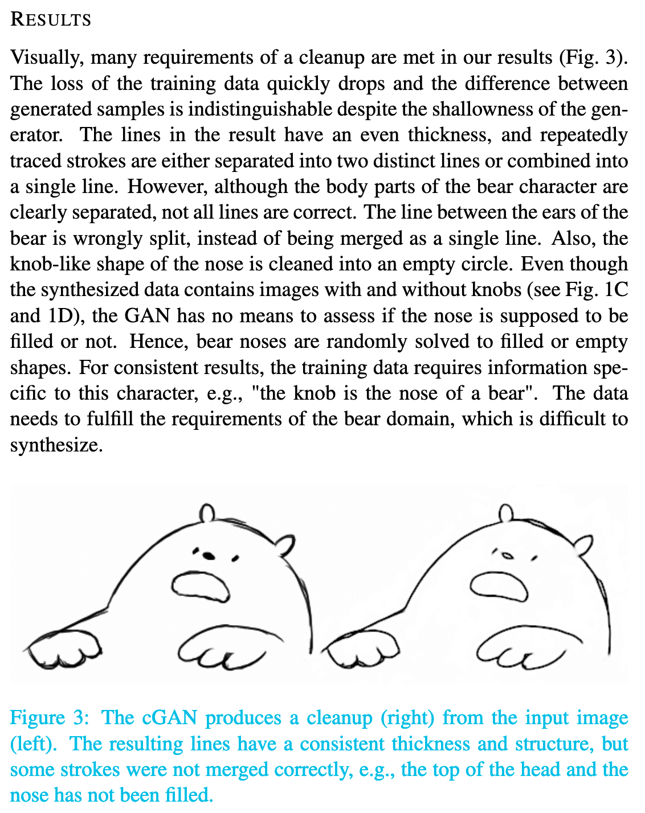
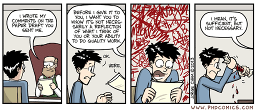

name: inverse
layout: true
class: center, middle, inverse
---

# Academic Methodologies

### Prof. Dr. Lena Gieseke | l.gieseke@filmuniversitaet.de  

#### Film University Babelsberg KONRAD WOLF

---
layout: false

## Today

--
* Writing - Final Thoughts

--
* Language & Style

--
* Publishing

--
* Academic Careers

--
* Wrap-up

---
.header[Paper Sections]

## Writing A Paper - Final Thoughts

Repeat yourself while never repeating text...

--

A common mistake is to repeat the same phrases, sentences etc.  
  
--

However, you have to bring up your main points over and over again e.g. to lead the reader through your paper. 

---
.header[Paper Sections]

## Writing A Paper - Final Thoughts

In academic writing, everything you say must directly be proofed in some form. 

???
.task[COMMENT:]  

* This is something that students who are new to academic writing often do incorrectly.  

Some problematic examples might look like as follows:

--
* "The problem is difficult."

???
.task[COMMENT:]  

* *Difficult for whom? Believed by you? Believed by others? Proven by someone? Difficult in what sense? Difficult when done blindly? Difficult when done without a brain? Difficult for your cat?*

--
* "The method is fast."

???
.task[COMMENT:]  

*Fast in comparison to what? Faster than a snail? Faster than the speed of light? Faster than your cat?*

--
* "The high quality of the results..."
* "The results look good."

--
* "As it can be seen…", "It has been shown..."  
  
--
  
Question all your statements and see **if the text answers to everything**. 

???
.task[COMMENT:]  

* For this also see the section about citations.

Now, that we know what to write, let's talk about the look, meaning the layout of a paper. As we all know, looks are important - that is just human nature. Unfortunately the world of paper writing is not as progressive as our world is (hopefully) slowly changing to the appreciation of all shapes, sizes and colors, moving away from standards, appreciating diversity and individuality. A beautiful paper, however, very much needs to follow standards. But of course - as in real life - the real beauty of a paper comes from within, and if the content of the paper is rubbish, the layout can not fix that.

---
template:inverse

#### Anatomy of a Paper
# Layout

---
## Layout

A paper should have a strong visual structure.  
  
Use section, sub-sections and bullet points. 
  
--
  
>  Good layout gives a reader an intuitive understanding of the paper on first glance.

???
.task[COMMENT:]  

* If in doubt, rather use a subsection to many than to few. Good layout gives a reader an intuitive understanding of the paper on first glance. My thesis advisor said to me for example that he can approximate a rough grade of a thesis, just by looking at its layout. And I think there is some truth to that. Also, I had it happened to me more than once that I thought I had structured my document well and it was given back to me with the comment that it needs more structure in the layout... A strong structure also helps to convey your content if there is a slight change that someone will only skim your text, e.g. for an application or expose where there are many submissions and some people are only superficially involved in the selection process.

I really can not give you any rules here to follow for structuring your text. It just depends on the content and its context. The only rule is: structure your text well with sections, subsections, bullet points and figures.  

For most paper submissions the venue will provide a set of rules for the text format and usually also a template for that. 

* You must stay within the given format, your paper might otherwise be rejected for just the wrong layout. Minor cheats, or let's call them tweaks, are ok as long as they are not really noticeable.

---
## Layout

Use figures such as drawings, diagrams, tables and graphs excessively.  

--

Ideally your whole paper is understandable just by going through the figures.

???
.task[COMMENT:]  

* As already mentioned, figures such as drawings, diagrams, tables and graphs are in the context of computer science and with that of course also HCI and CTech, crucially important for academic writing. Use figures excessively. Ideally your whole paper is understandable just by going through the figures. There are a couple of aspects to consider when working with figures:

* Numbered
* Have a caption (not easy to write)
* If it is not discussed in the text, cut it
* Try to match its position to the flow of the text

* They are numbered.
* They have a descriptive caption and a long description in the paragraph, where they are referenced. Keep in mind that good captions are not easy to write.
* If a figure is not discussed in the text, cut it.
* Try to match a figure's position to the flow of the text. The figure should be put close to the text, where it is references. This might be especially tricky in LaTeX (we are coming back to LaTeX).  

Using italics or bold font for emphasis are problematic in academic writing. I am struggling with that a little as I think they help to visually structure a text (and I use italics for emphasis in the scripts for example). But the rule in academic writing is to only use italics once for introducing a new term and to never use bold, except for header and titles and such.

Last but not least, make sure that everything in your paper is readable printed on paper! I always have problems with this because I like to use grays for figures and layout and grays that look super nice on screen oftentimes are not distinguishable printed out. The same problem applies when preparing a presentations and the difference between the slides on your screen and the slides on the projector.

Now that we have reflected on the beauty of the layout, let's think about the beauty of the language itself.

.center[] 

---
template: inverse

# Language

???
.task[COMMENT:]  

* Of course, correct spelling and grammar is a must in academic writing. If you want to improve your grammar (and yes, I know, I myself have still some issues here - did someone say commata?!) there is a universe of resources for that from our friend, the internet. I particularly like to check in with grammar test, such as the [grammar book](http://www.grammarbook.com/interactive_quizzes_exercises.asp).

*What do you think we need to look out for in terms of language?*

---
.header[Language]

## Precision

???
.task[COMMENT:]  

* One of the golden rules for the language of academic writing is - in all disciplines - to be precise. However, what preciseness means differs from discipline to discipline. In our context is means clean, somewhat simple language.

--
* Clean, simple language

???
.task[COMMENT:]  

*  The language must not give a reader any extra thinking to do - the content is difficult enough on its own. The value of the work is in your research project contributions and the language should make those aspects clear, not obscure what you did with complicated language. You will notice for yourself that some writings try to hide weak results, thoughts, etc. behind complex language.

--
* Rule of thumb: use as few words as possible

???
.task[COMMENT:]  

* When working with native English speakers as a native German speaker the aspect of simple language is especially difficult. Simple German is in comparison to simple English still ten times more complex. Whenever I work with native English speakers they still simplify my sentences... 🤬 (the learning never stops...).

The website [daily writing tips](https://www.dailywritingtips.com/) describes the following helpful [techniques for more precise writing](https://www.dailywritingtips.com/10-techniques-for-more-precise-writing/)

---
.header[Language | Precision]

## Avoid Vague Nouns  

Phrases formed around general nouns such as *aspect*, *degree*, and *situation* clutter sentences.  

* Don't: “She is an expert in the area of international relations.”  
* Do: “She is an expert in international relations.”  

---
.header[Language | Precision]

## Reduce Verb Phrases to Simple Verbs  

Identify the verb buried in a verb phrase and omit the rest of the phrase.  

* Don't: “The results are suggestive of the fact that tampering has occurred.”  
* Do: “The results suggest that tampering has occurred.”

---
.header[Language | Precision]

## Avoid Expletives  

Don’t start sentences with “There is,” “There are,” or “It is.”

* Don't: “There are many factors in the product’s failure.”  
* Do: “Many factors contributed to the product’s failure.”

---
.header[Language | Precision]

## Use Words, Not Their Definitions  

Replace explanatory phrases with a single word that encapsulates that explanation.  

* Don't: “The crops also needed to be marketable so that families would be able to sell any yields that exceeded what they personally required.”  
* Do: “The crops also needed to be marketable so that families would be able to sell any surplus.”

---
.header[Language | Precision]

## Eliminate Prepositional Phrases

Replace “(noun1) of the (noun2)” phrasing with “(noun2)’s (noun1)” phrasing.

* Don't: “The decision of the committee is final.”  
* Do: “The committee’s decision is final.”

---
.header[Language | Precision]

## Use Active Voice  

When a sentence includes *be* or any other copulative verb, such as *is* or *are*, recast the sentence to omit the verb.

* Don't: “The meeting was seen by us as a ploy to delay the project.”  
* Do: “We saw the meeting as a ploy to delay the project.”

---
.header[Language]

## Gender-Inclusive Language

Gender inclusive language is fully embraced in the academic world.

--

Overall, the best solution is to make the nouns and pronouns plural.  

* Don't: A student who loses too much sleep may have trouble focusing during [his/her] exams.  
* Do: Students who lose too much sleep may have trouble focusing during their exams.

---
template:inverse

# Style

---
## Style

In academic writing you must avoid

* emotional language,
* flowery language, and
* superlatives.

???
.task[COMMENT:]  

* Overall though, writing style simply is subjective. If you give your paper to experienced writers they will be affected by their personal style and will give you many, many corrections. These corrections might not improve errors but might just try to make the text match more the personal writing style of the corrector. Take in the feedback, reflect on it but also stand your ground if your personal writing style is different.

---
## Style

.center[]  
[[phdcomics]](http://www.phdcomics.com/comics/archive.php?comicid=1576)

---
template: inverse

### Chapter 10
# Academic Publishing

---
layout: false

## Academic Publishing

--

The main motivations for academic publishing are

--
* Documentation of research results

--
* Quality Assessment

--
* Reproducibility

--
* Contextual integration

--
Publications are required for

--
* Scholarships
* Grants
* Jobs in academia
* Research positions
* ...

???
.task[COMMENT:]  

* Bibliometrics is the use of statistical methods for quality measures to to analyse

* What is one of the main methods for quality assessment?

---
.header[Academic Publishing]

## Quality Assessment

???
.task[COMMENT:]  

* What is the common scientific approach to a quality assessment?
* 
--

Peer review is based on the technique that people from the same research community with similar competencies and expertise evaluate the work of a peer.  

--

It functions as a form of self-regulation by qualified members of the community.

???
.task[COMMENT:]  

* https://github.com/ctechfilmuniversity/conference_acsfub.github.io/blob/master/review_template_preview.txt

---
.header[Academic Publishing | Quality Assessment]

## Peer Review

.center[]

---

## Publications Types

???
.task[COMMENT:]  

* Which different publication types do you remember with which properties

--

.center[]

---

## Bibliometrics

???
.task[COMMENT:]  

* What are Bibliometrics?

--

Bibliometrics is the use of statistical methods for quality measures to analyse  

* Journals
* Conferences
* Authors

Impact factor (IF), h-index, i10 index

???
.task[COMMENT:]  

* The impact factor (IF) or journal impact factor is an index that reflects the yearly average number of citations that articles published in the last two years in a given journal received. 
* The h-index is an author-level metric that attempts to measure both the productivity and citation impact of the publications of a scientist or scholar. 

---
.header[Academic Publishing]

## Problems With The Current System

???
.task[COMMENT:]  

* What can be seen as the main problems?

--

* Accessibility
* Quality

---
.header[Academic Publishing]

## Problems With The Current System

* Accessibility
    * Free labor from universities / large margin for private publishing houses
    * Access fees are high
    * Alternative: open access strategies
--
* Quality
    * Review results might be close to random
    * Only positive results are publishable

???
.task[COMMENT:]  

* A possible solution are so called *open access* venues. The general idea is that the authors themselves pay for publications and to access those papers is free.  

---
template: inverse

# Academic Careers

---
## Is a Phd For You?

--

> Did you enjoy working on your bachelor / master thesis?  
  
--

* Teaching
* Self-organization
* Lose working times 

---
## Is a Phd For You?

"Soft skills" are equally important as research skills...

--

* Endurance
* Adaptation
* Self-organization
* Handling of pressure

---
#### Is a Phd For You?

* SG 2013 - CANCELLED
* PG 2013 - REJECT
* EG 2014 - REJECT
* EGSR 2014 - ACCEPT
* CVMP 2014 (short) - ACCEPT
* BIG DATA 2014  (short) - ACCEPT
* DFG Sachbeihilfeantrag 2014 - ACCEPT
* CA 2015 (short) - ACCEPT
* SG 2016 - REJECT
* UIST 2016 - REJECT
* PATENT  P6060-US - ACCEPT
* EG 2017 - REJECT
* CA 2017 - ACCEPT

???
.task[COMMENT:]  

* My PhD had the following, mediocre but quite normal, submission history:

---
## Is a Phd For You?

Some excerpts of the reviews I got over time... Ouch! 😔 

* I was completely **disappointed by** […]
* The results of this paper are **not reasonable**.
* This paper is disappointing as it **lacks novelty**.
* […] the paper describes a longer list of minor changes to an existing algorithm. […] reuses a lot of established concepts […] **does not seem to lead to fundamental new insights** or **significant technical challenges**.
* This paper does not seem to advance the state-of-the-art in any way. 
*  […] would **not** consider the paper **a major practical break-through**.
* I'm not very enthusiastic about the paper […]

---
## Is a Phd For You?

Some excerpts of the reviews I got over time... Ouch! 😔 

* […] make the results **hardly meaningful**.
* I am **skeptical of the value** of the presented studies.
The problem addressed in the paper **does not seem very new** and the proposed algorithms also **do not offer any particular insights**. Therefore, I think this paper **is not significant enough**.
* The manuscript also fails to present the (rather simple) technique in a concise (and correct) way. 
* […] **makes no sense**.

---
## Financing a Phd

.left-even[
* Mitarbeiter*innen Stellen
    * Include other tasks such as teaching and administration
    * Not always full-time
    * Only very sparsely available
    * Usually very open topic-wise
]

---
## Financing a Phd

.left-even[
* Mitarbeiter*innen Stellen
    * Include other tasks such as teaching and administration
    * Not always full-time
    * Only very sparsely available
    * Usually very open topic-wise
* "Kolleg" scholarships
    * Focus on research
    * 1000-1500 Euro a month, but no taxes
    * Have a main topic
]

--

.right-even[
* Institutional scholarships
    * Political
    * Religion
    * Social
    * Topic-based
]

???
.task[COMMENT:]  

* https://www.filmuniversitaet.de/fileadmin/user_upload/pdfs/promotion/Links_zu_Stipendien_Sep_17__1_.pdf

---
## Phd Topics

--

* The topic and research area should play to your strength in terms of methodology
* You must *really, really* like you topic

--

> Any topic becomes interesting when you get into the details...

---
## Phds at Filmuni
  
* Academic 
    * Media Studies
    * Doctor of Philosophy (Dr. phil. )

--

* Academic-artistic 
    * Screenwriting/Dramaturgy
    * Film Culture Heritage
    * Production
    * Doctor philosophiae in artibus (Dr. phil. in art.)

???
.task[COMMENT:]  

Planned
* Academic 
    * Computer Science / Creative Technologies
    * Doctor of Engineering (Dr.-Ing.)
* Academic-artistic Creative Technologies
* Dr != Ph.D.

---
## After a Phd: Industry

* As further qualification
* In a research department

---
## After a Phd: Academia

--
* Post-doc
    * Research publications
    * Write grants and research proposals
    * Guide Phd students
    * Project / group leader
    * 3 stops in 2 countries
    * Max. 6 years
--
* Junior Professor
    * Tenure-track vs. non tenure-track (do not!)

--
* Professor
    * W2, W3

---
template: inverse

# Wrap-Up

???
.task[COMMENT:]  

* from coming up with a research idea, over developing a suitable methodology, executing the chosen methods correctly, evaluating your work, to writing about it in an academic fashion and publishing it at an academic venue for the world to see.
* https://ctechfilmuniversity.github.io/lecture_academic_methodologies/

---
template:inverse

### The End

# 👋🏻

